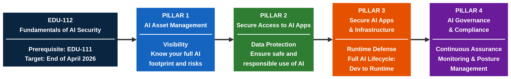
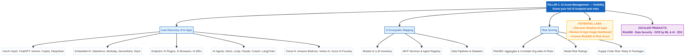
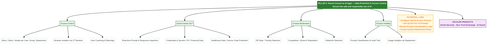
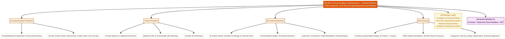
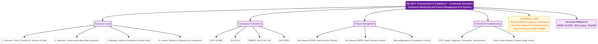

# EDU-112: Fundamentals of AI Security — Course Structure

## Overview

## Pillar 1: AI Asset Management (Visibility)

## Pillar 2: Secure Access to AI Apps (Data Protection & Access Control)

## Pillar 3: Secure AI Apps & Infrastructure (Runtime Defense)

## Pillar 4: AI Governance & Compliance (Continuous Assurance)

## Files

| File | Description |
|------|-------------|
| `00_overview.mmd` | Course overview flowchart (Mermaid source) |
| `01_pillar1.mmd` | Pillar 1 detail chart (Mermaid source) |
| `02_pillar2.mmd` | Pillar 2 detail chart (Mermaid source) |
| `03_pillar3.mmd` | Pillar 3 detail chart (Mermaid source) |
| `04_pillar4.mmd` | Pillar 4 detail chart (Mermaid source) |

## How to Edit

All `.mmd` files use [Mermaid flowchart syntax](https://mermaid.js.org/syntax/flowchart.html). Edit in any text editor and render using the [Mermaid Live Editor](https://mermaid.live/) or VS Code with the Mermaid extension.
